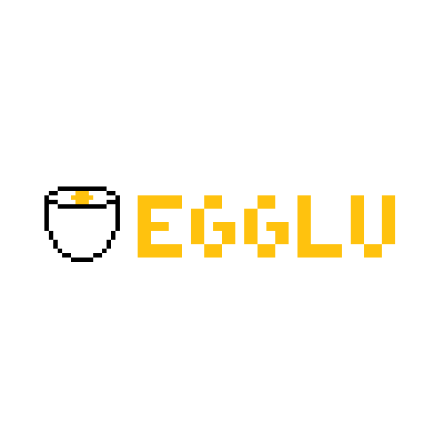
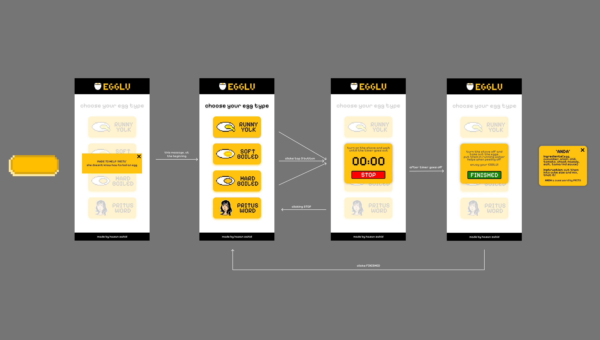

# Egglu - Your Egg-Boiling Assistant

<div align="center">  </div>

**Egglu** is a fun and interactive React-based web application designed to help you boil the perfect egg. Whether you prefer a runny yolk, soft-boiled, hard-boiled, or a quirky custom recipe by "Pritu," Egglu has you covered with a timer, notifications, and step-by-step guidance in a playful, with pixelated UI.

Built with React and styled with custom CSS, Egglu features a clean layout, interactive cards, a countdown timer, and popups with sound effects to make your egg-boiling experience both practical and enjoyable. Perfect for EGG ESPECIALIST and people like you who do not know how to boil an EGG!

---

## Features

- **Egg Type Selection**: Choose from "Runny Yolk" (6 mins), "Soft Boiled" (8 mins), "Hard Boiled" (10 mins), or "Pritus Recipe" via interactive cards.
- **Countdown Timer**: Set a timer based on your egg type, with a visual countdown and stop button.
- **Popup Notifications**: Get instructions and alerts, like when to turn off the stove, complete with a chicken themed sound effect (`kokok_alarm.mp3`).
- **Pritu’s Recipe**: A unique egg-based recipe popup with ingredients and instructions.
- **Responsive Design**: Adapts to various screen sizes with flexible layouts and media queries.
- **Custom Styling**: Powered by the "Pixelify Sans" font and a vibrant, egg inspired color scheme.

---

## Project Structure

The app is built with React components and corresponding CSS files for styling. Here’s an overview:

### Components
- **`App.js`**: The main entry point, rendering the `Screen` component.
- **`Screen.js`**: Manages state for notifications, countdowns, and recipe popups; orchestrates the app’s layout.
- **`Header.js`**: Displays the Egglu logo in a sleek black header.
- **`Body.js`**: Contains interactive cards for egg type selection.
- **`BottomBar.js`**: A simple footer crediting the creator, Hasan Zahid.
- **`Card.js`**: Reusable button component with icons and text for egg options.
- **`Countdown.js`**: Handles the timer logic and triggers a completion popup.
- **`Notification.js`**: Shows an introductory notification with a close button.
- **`PopupBox.js`**: Displays post-timer instructions with a sound effect and finish button.
- **`PritusRecipe.js`**: A popup with a custom egg recipe by Pritu.

### CSS Files
- **`Screen.css`**: Full-screen layout styling.
- **`Header.css`**: Black header with centered logo and shadow effects.
- **`Body.css`**: Background image and card layout with blur effects for popups.
- **`BottomBar.css`**: Centered footer with white text.
- **`Card.css`**: Interactive button styles with a PNG background and click animations.
- **`Countdown.css`**: Yellow timer popup with bold typography and a red stop button.
- **`Notification.css`**: Centered notification box with a close icon.
- **`PopupBox.css`**: Instruction popup with a green finish button.
- **`PritusRecipe.css`**: Recipe popup with structured text formatting.

---

## Installation

1. **Clone the Repository**:
   ```bash
   git clone https://github.com/yourusername/egglu.git
   cd egglu
   ```

2. **Install Dependencies**:
   Make sure you have Node.js installed, then run:
   ```bash
   npm install
   ```

3. **Run the App**:
   Start the development server:
   ```bash
   npm run dev
   ```
   Open `http://localhost:3000` in your browser to see Egglu in action!

---

## Usage

1. **Start the App**: On load, a notification greets you with "LET ME HELP YOU BOIL AN EGG. I AM CHICKEN." Click the "X" to dismiss it.
2. **Choose an Egg Type**: Select from the cards in the body section:
   - "Runny Yolk" (6 minutes)
   - "Soft Boiled" (8 minutes)
   - "Hard Boiled" (10 minutes)
   - "Pritus Recipe" (shows a recipe popup)
3. **Timer**: For egg types, a countdown starts with instructions. Stop it anytime with the red "STOP" button.
4. **Completion**: When the timer hits zero, a popup with a sound effect instructs you to turn off the stove and cool the eggs.
5. **Recipe**: The "Pritus Recipe" card opens a popup with ingredients and instructions for a unique egg dish.

---

## Figma



---

## Materials Used

- **React**: Frontend framework for building components.
- **CSS**: Custom styling with the "Pixelify Sans" font from Google Fonts.
- **Figma**: Initial prototyping and visualization.
- **Assets**: Images (`eggluLogo.png`, `button.png`, `background.jpg`, etc.) and audio (`kokok_alarm.mp3`).

---

## Credits

- **Created by**: Hasan Zahid  

---

## License

This project is open-source and available under the [MIT License](LICENSE).